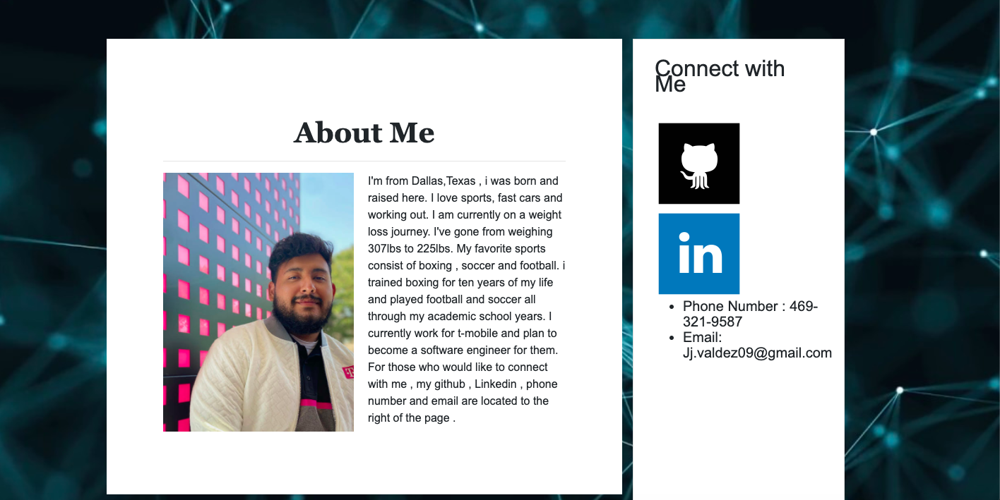
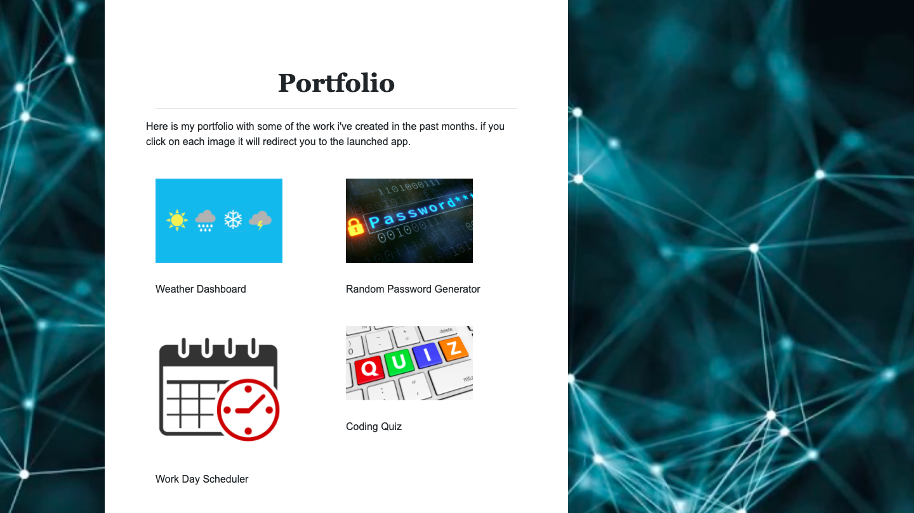
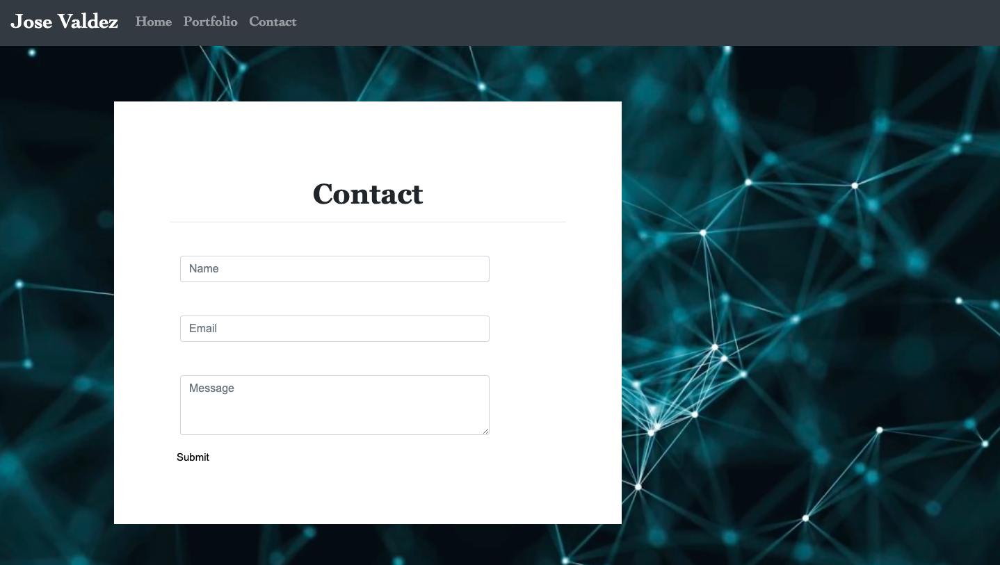

# CSS-Bootsrap portfolio
This is a responsive portfolio created from css and Bootstrap
This responsive portfolio was contains bio information about the programer 
this responsive portfolio adapts to different devices or screen size

Update . This respnsive portfolio has been updated with pictures and some of my apps that i've done in the past month or so. i added a background to give it a different style and added a side bar so people can connect with me on my github and linked in . i also included my phone number and email. 

deployed link :  https://jayjay2397.github.io/ResponsivePortfolio

